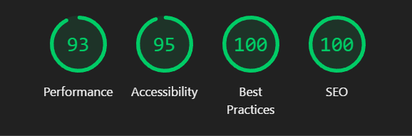

# 💼 My Portfolio 2.0


## 📖 Project Description
My latest personal portfolio and flagship project. A representation of my latest personal showcase, highlighting my growth and capabilities as a developer. This modern and refined version of my previous portfolio demonstrates my proficiency with contemporary web technologies and my dedication to creating visually appealing and highly functional web applications.

## 🛠️ Technologies Used
 


## 🎨 Project Features
- **Mobile First**: Designed with a mobile-first approach to ensure a seamless experience across all devices.
- **Contact Form**: A functional and interactive contact form for visitors to get in touch with me.
- **Multilingual**: The site is available in both English and Spanish, utilizing the i18n library for seamless language switching.
- **Custom Domain**: Hosted on a personalized domain for a professional web presence.

## 🌐 Hosting and Domain


- **Hosting**: The project is hosted on **Netlify**, ensuring fast and reliable performance with seamless deployment workflows.
- **Domain**: The custom domain was purchased from **Namecheap**, providing a professional and memorable web address.

## 📈 Performance Report

Below is the performance report generated using [Lighthouse](https://developers.google.com/web/tools/lighthouse):



This report evaluates the performance, accessibility, best practices, and SEO of the website, ensuring that it meets the highest standards for modern web development.

## 🏗️ Project Structure
The basic structure of my Astro project is as follows:

```text
├── dist/
├── public/
│ └── favicon_io/
│ │   └── favicons
│ └── images
├── src/
│ ├── components/
│ │ └── icons/
│ │ └── AllMyComponents.astro
│ ├── data/
│ │ └── navItems.ts
│ │ └── projects.ts
│ │ └── skills.ts
│ ├── i18n/
│ │ └── en.json
│ │ └── es.json
│ │ └── index.ts
│ ├── layouts/
│ │ └── Layout.astro
│ ├── pages/
│ │ └── en/
│ │ │   └── contact.astro
│ │ │   └── index.astro
│ │ └── contact.astro
│ │ └── index.astro
├── astro.config.mjs
├── package.json
└── tailwind.config.mjs
```

## 📬 Contact Information
Please fill in your contact details here.

[](https://aimarbusta.dev/)
[](https://www.linkedin.com/in/aimarbustamante/)
[](https://www.instagram.com/aimarbusta.dev/) 
[](mailto:aimarbustamante379@hotmail.com) 
[](https://wa.me/65167602) 
[](https://www.frontendmentor.io/profile/AimarBustamante) 

---

Thank you for visiting my portfolio!
